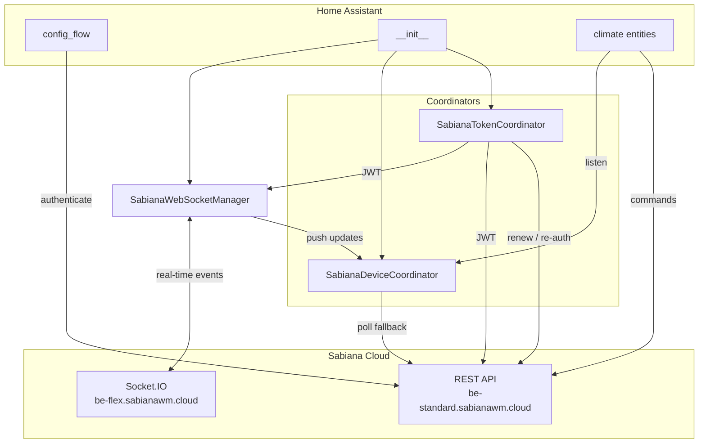

# Sabiana HVAC Integration — Technical Architecture

## Purpose and Scope

This document explains how the `sabiana_hvac` custom integration works internally, how it integrates with Home Assistant, and which architectural decisions shape its current behavior.

The integration provides cloud-based control of compatible Sabiana HVAC units by:

- authenticating against Sabiana cloud REST APIs,
- discovering available devices,
- maintaining real-time state through a Sabiana Socket.IO WebSocket,
- falling back to REST polling when the WebSocket is unavailable,
- exposing each device as a Home Assistant `climate` entity,
- translating Home Assistant climate actions into Sabiana command payloads.

State is synchronized from the cloud (WebSocket + REST), with a short optimistic window after local commands to keep the UI responsive while the device processes changes.

---

## High-Level System Architecture

At runtime, the integration is composed of seven core modules:

| Module | Responsibility |
|--------|----------------|
| `config_flow.py` | Interactive setup from the Home Assistant UI |
| `__init__.py` | Config entry lifecycle, runtime wiring, platform forwarding |
| `api.py` | HTTP client, authentication, `lastData` decoding, command dispatch |
| `coordinator.py` | JWT lifecycle (`SabianaTokenCoordinator`) and device state (`SabianaDeviceCoordinator`) |
| `websocket.py` | Socket.IO connection for real-time device updates |
| `climate.py` | Climate entities, command encoding, coordinator listeners |
| `const.py` | Constants, endpoints, mode mappings, poll intervals |

Supporting modules:

- `models.py` — `JWT` and `SabianaDeviceState` data models
- `manifest.json` — integration registration and dependencies



---

## Integration with Home Assistant

### Manifest and Registration

The integration is registered through `custom_components/sabiana_hvac/manifest.json`:

- `domain`: `sabiana_hvac`
- `config_flow`: `true`
- `iot_class`: `cloud_push` (WebSocket push with REST fallback)
- `requirements`: `httpx`, `voluptuous`, `httpx-retries`, `python-socketio[asyncio_client]`

Only the `climate` platform is exposed (`PLATFORMS = [Platform.CLIMATE]`).

### Config Entry Lifecycle

Home Assistant integration lifecycle is implemented in `__init__.py`:

1. **`async_setup_entry`**
   - validates JWT tokens in the `ConfigEntry`,
   - creates a reusable HTTP session with retry support,
   - instantiates `SabianaTokenCoordinator` and runs the first refresh,
   - fetches devices from the Sabiana REST API,
   - creates `SabianaWebSocketManager` and attempts a non-blocking connect,
   - instantiates `SabianaDeviceCoordinator` (WebSocket + REST polling),
   - stores runtime objects in `hass.data[DOMAIN][entry_id]`,
   - forwards setup to the `climate` platform.

2. **`async_unload_entry`**
   - unloads climate platform entities,
   - disconnects the WebSocket manager,
   - shuts down the device coordinator (unregisters callbacks),
   - removes cached runtime objects from `hass.data`.

The runtime data store for each entry contains:

| Key | Type | Purpose |
|-----|------|---------|
| `session` | `httpx.AsyncClient` | Shared HTTP client with retries |
| `token_coordinator` | `SabianaTokenCoordinator` | JWT refresh and persistence |
| `device_coordinator` | `SabianaDeviceCoordinator` | Device state map (`dict[str, SabianaDeviceState]`) |
| `websocket_manager` | `SabianaWebSocketManager` | Real-time Socket.IO connection |
| `devices` | `list[SabianaDevice]` | Discovered device metadata |

---

## Configuration Flow (UI Setup)

The user onboarding flow in `config_flow.py` follows Home Assistant's standard `ConfigFlow` model:

1. Prompt user for `email` and `password`.
2. Call `api.async_authenticate(...)`.
3. On success:
   - set unique ID to lowercase email (`async_set_unique_id(email.lower())`),
   - prevent duplicate setup for the same account,
   - persist credentials and JWTs in the config entry.
4. On failure:
   - map connection/auth/API errors to localized HA form error keys.

### Data Persisted in ConfigEntry

| Field | Description |
|-------|-------------|
| `email`, `password` | Account credentials for re-authentication |
| `short_jwt`, `short_jwt_expire_at` | Short-lived API token and expiry (unix timestamp) |
| `long_jwt`, `long_jwt_expire_at` | Long-lived renewal token and expiry |

This allows startup without immediate re-login while enabling long-term automatic token maintenance.

---

## API Layer Design

The `api.py` module centralizes all REST communication with Sabiana cloud endpoints and enforces strict response validation.

### Endpoints Used

| Method | Path | Purpose |
|--------|------|---------|
| `POST` | `/users/newLogin` | Authenticate; obtain short/long JWTs |
| `GET` | `/devices/getDeviceForUserV2` | List devices and `lastData` state blobs |
| `POST` | `/renewJwt` | Renew short JWT using long JWT |
| `POST` | `/devices/cmd` | Send command payload to a device |

Base URL: `https://be-standard.sabianawm.cloud` (`const.BASE_URL`).

### HTTP Client and Retry

`create_session_client(...)` creates an HA-managed `httpx.AsyncClient` and applies `RetryTransport`:

- total retries: 3
- backoff factor: 0.5
- timeout: 5.0 seconds

### Error Model

Custom exception hierarchy:

- `SabianaApiClientError` (base)
- `SabianaApiAuthError` (authentication-specific)

Response validation runs in two stages:

1. **HTTP status** — `401` → `SabianaApiAuthError`; other `>= 400` → `SabianaApiClientError`
2. **API JSON status** — `99` or `103` → `SabianaApiAuthError`; any non-zero → `SabianaApiClientError`

### JWT Expiry Parsing

JWT expiration is derived from the token payload:

- decode JWT payload (`base64url`),
- extract `exp` claim,
- convert to timezone-aware UTC `datetime`.

Malformed tokens or missing `exp` fail setup with `SabianaApiClientError`.

### Device State Decoding (`lastData`)

Device telemetry arrives as a hexadecimal `lastData` string (from REST or WebSocket). `decode_last_data()` maps it to `SabianaDeviceState` using the Sabiana app's Modbus register layout:

| Word | Bytes | Content |
|------|-------|---------|
| 1 | 0–1 | Controller model |
| 3 | 4–5 | Fan mode (byte 4) + HVAC mode (byte 5) |
| 4 | 6–7 | Power / sleep flags (byte 7); bit 2 = `auto_mode_available` |
| 5 | 8–9 | Flap position + presence flag → swing mode |
| 6 | 10–11 | Current temperature (×10, big-endian) |
| 7–9 | 12–17 | Summer / winter / auto setpoints (mode-dependent) |

Notable decoding rules:

- **HVAC mode** — lower nibble of byte 5; power-off when byte 7 lower nibble is `0x00`
- **Target temperature** — selected from summer/winter/auto setpoint bytes based on active mode (`MODE_SETPOINT_BYTES`)
- **Fan mode** — exact byte map with range-based fallback for unknown controller encodings
- **Swing mode** — flap position via `FLAP_POSITION_TO_SWING_MODE` when flap-present flag is set
- **Preset / sleep** — bit 7 of byte 7 (`0x80` → `sleep`)
- **AUTO capability** — bit 2 of byte 7; exposed dynamically on climate entities

`extract_device_states_from_devices()` decodes all devices from a `getDeviceForUserV2` response for REST polling.

### Command Encoding

Climate entities build a fixed-format hex command string:

```
0{fan}0{mode}{temp_hex}0{swing}01FFFF000{preset}
```

- modes/fan/swing mapped via `HVAC_MODE_MAP`, `FAN_MODE_MAP`, `SWING_MODE_MAP`
- temperature: Celsius × 10 as 4-digit hex (e.g. `25.0` → `00fa`)
- preset: `sleep` → `"2"`, otherwise `"0"`

Commands are sent via `POST /devices/cmd` with `start: 2304`.

---

## Token Lifecycle Management

`SabianaTokenCoordinator` runs on a **60-second** update interval.

### Refresh Algorithm

At each cycle (with a **5-minute safety margin** before expiry):

1. If **long JWT** is expired or expiring soon → full re-authentication with stored credentials.
2. Else if **short JWT** is expired or expiring soon → `renewJwt`; on auth failure, fallback to full re-auth.
3. Else → keep current token.

On success, tokens are persisted via `async_update_entry(...)`.

### Force Renew

`async_force_renew()` bypasses expiry checks when the server rejects a locally valid token (e.g. revocation). Climate command handlers call this on `SabianaApiAuthError` and retry once.

### Failure Behavior

API and network errors become `UpdateFailed`, Home Assistant's standard coordinator failure signal.

---

## WebSocket Layer

`SabianaWebSocketManager` (`websocket.py`) connects to `https://be-flex.sabianawm.cloud` using `python-socketio` with JWT auth.

### Connection Behavior

- Refreshes the JWT via `token_coordinator.async_request_refresh` before each connect (important for reconnects).
- Uses `aiohttp.ThreadedResolver()` to avoid broken `aiodns`/`pycares` combinations in some HA environments.
- Disables Socket.IO built-in reconnection; implements **exponential backoff** (5s initial, 300s max).
- On reconnect failure, triggers REST refresh callbacks so state does not go stale.

### Socket.IO Events

| Event | Payload | Action |
|-------|---------|--------|
| `data` | `{ device, data: hex }` | Decode `lastData` → push to device coordinator |
| `connEvents` | `{ device, data: CONNECT\|DISCONNECT }` | Log device connectivity (callbacks available) |
| `status` | firmware / RSSI | Logged; no state change today |
| `appMsg` | `{ msg: "refresh" }` | Trigger immediate REST poll |
| `error` | error payload | Logged |

### Callback Registration

The manager exposes unregisterable callbacks for:

- device state updates,
- connection status changes (used to adjust REST poll interval),
- server refresh requests.

---

## Device State Coordinator

`SabianaDeviceCoordinator` owns `dict[str, SabianaDeviceState]` and bridges WebSocket push with REST polling.

### Update Sources

1. **WebSocket** — `data` events update a single device entry and call `async_set_updated_data`.
2. **REST poll** — periodic `GET /devices/getDeviceForUserV2`, decode `lastData` for tracked device IDs.
3. **Server refresh** — `appMsg: refresh` or reconnect failure triggers `async_request_refresh`.

### Adaptive Poll Intervals

| WebSocket state | Interval | Constant |
|-----------------|----------|----------|
| Connected | 30 minutes | `WS_CONNECTED_POLL_INTERVAL` (1800s) |
| Disconnected | 2 minutes | `DEFAULT_POLL_INTERVAL` (120s) |

When connection status changes, the coordinator updates `update_interval` dynamically.

Each poll cycle also refreshes the JWT via `token_coordinator` before calling the API.

---

## Climate Entity Model

`SabianaHvacClimateEntity` maps each `SabianaDevice` to one climate entity.

### Entity Capabilities

Default HVAC modes: `off`, `cool`, `heat`, `fan_only`.

**AUTO** is added or removed at runtime when `SabianaDeviceState.auto_mode_available` is true (bit 2 of byte 7 in `lastData`).

Other features:

- target temperature (10–30 °C, 0.5 °C step)
- fan modes: `low`, `medium`, `high`, `auto`
- swing modes: `Vertical`, `Horizontal`, `45 Degrees`, `Swing`
- preset modes: `none`, `sleep`
- turn on / turn off

Entity characteristics:

- `_attr_should_poll = False` — state driven by coordinators, not per-entity polling
- `RestoreEntity` — restores last HA state on restart if coordinator data is not yet available
- subscribes to `SabianaDeviceCoordinator` via `async_add_listener`

### Command Execution Pipeline

1. User changes a climate attribute → entity updates internal state.
2. `_async_execute_command()` builds payload, records `_last_command_time`, refreshes token.
3. `api.async_send_command(...)` sends to cloud.
4. On `SabianaApiAuthError` → `async_force_renew()` and single retry.
5. On success → `async_write_ha_state()` and schedule `_async_delayed_refresh()` (5s) to reconcile with device.

Temperature changes write HA state immediately but only send a command when HVAC mode is not `off`.

### Optimistic State Window

After a command, the entity ignores coordinator updates to **writable** attributes for **10 seconds** (`_optimistic_update_duration`). Only `current_temperature` is updated during this window.

This prevents stale `lastData` (pre-command device state) from reverting the UI before the cloud reflects the change.

### State Reconciliation

Outside the optimistic window, `_update_full_state()` applies coordinator data:

- HVAC mode, target/current temperature, fan, swing, preset
- dynamic AUTO mode list maintenance

---

## Runtime Data Flow

### Inbound (cloud → Home Assistant)

```
Sabiana cloud
  ├─ WebSocket "data" event (hex lastData)
  │     └─ decode_last_data → SabianaDeviceCoordinator.data[device_id]
  │           └─ climate entity listener → async_write_ha_state
  └─ REST poll (getDeviceForUserV2)
        └─ extract_device_states_from_devices → same coordinator path
```

### Outbound (Home Assistant → cloud)

```
User / automation
  └─ climate entity setter
        └─ _build_command_payload → POST /devices/cmd
              └─ delayed REST refresh (5s) for reconciliation
```

---

## Reliability and Observability

### Reliability Controls

- centralized response validation in the API layer,
- explicit auth vs generic error separation,
- HTTP retry transport for transient failures,
- JWT refresh with 5-minute safety margin and force-renew on server rejection,
- WebSocket reconnect with exponential backoff,
- REST polling as fallback when WebSocket is down,
- optimistic command window to avoid UI flicker from stale telemetry.

### Logging

Structured logging at `info`, `debug`, `warning`, and `exception` levels across setup, token lifecycle, WebSocket events, decoding, and command dispatch.

---

## Security Considerations

- Credentials are stored in Home Assistant config entry storage and used only to authenticate against Sabiana cloud.
- Token expiry is validated from JWT `exp` claims.
- Authorization headers: short JWT in `auth`; long JWT in `renewauth` for renewal.
- No custom cryptography; the integration consumes Sabiana-issued JWTs and API contracts.

---

## Testing Strategy

Unit tests in `tests/`:

| File | Coverage |
|------|----------|
| `test_config_flow.py` | Setup flow, error mapping |
| `test_api.py` | Response validation, JWT parsing, `lastData` decoding, endpoints |
| `test_coordinator.py` | Token refresh/re-auth decisions, update persistence |
| `test_climate.py` | Entity capabilities, payload generation, command execution |

Run tests from the dev container:

```bash
pytest tests/
```

---

## Current Limitations

1. **Cloud dependency** — availability depends on Sabiana REST and WebSocket infrastructure.
2. **Unofficial API** — reverse-engineered from the mobile app; Sabiana may change contracts without notice.
3. **Model support** — tested primarily on **Sabiana Carisma Fly**; other models may use different `lastData` encodings (fan byte fallback exists for this).
4. **Beta status** — functional but may have edge cases in decoding or reconnect scenarios.

---

## File-Level Reference Map

| File | Role |
|------|------|
| `manifest.json` | Domain registration, `iot_class`, dependencies |
| `config_flow.py` | UI setup and credential/token persistence |
| `__init__.py` | Setup/unload orchestration, runtime `hass.data` |
| `api.py` | REST client, validation, `lastData` codec, commands |
| `coordinator.py` | `SabianaTokenCoordinator`, `SabianaDeviceCoordinator` |
| `websocket.py` | `SabianaWebSocketManager`, Socket.IO event handling |
| `climate.py` | Climate entities, command encoding, state sync |
| `const.py` | URLs, intervals, mode maps, error keys |
| `models.py` | `JWT`, `SabianaDeviceState` |
