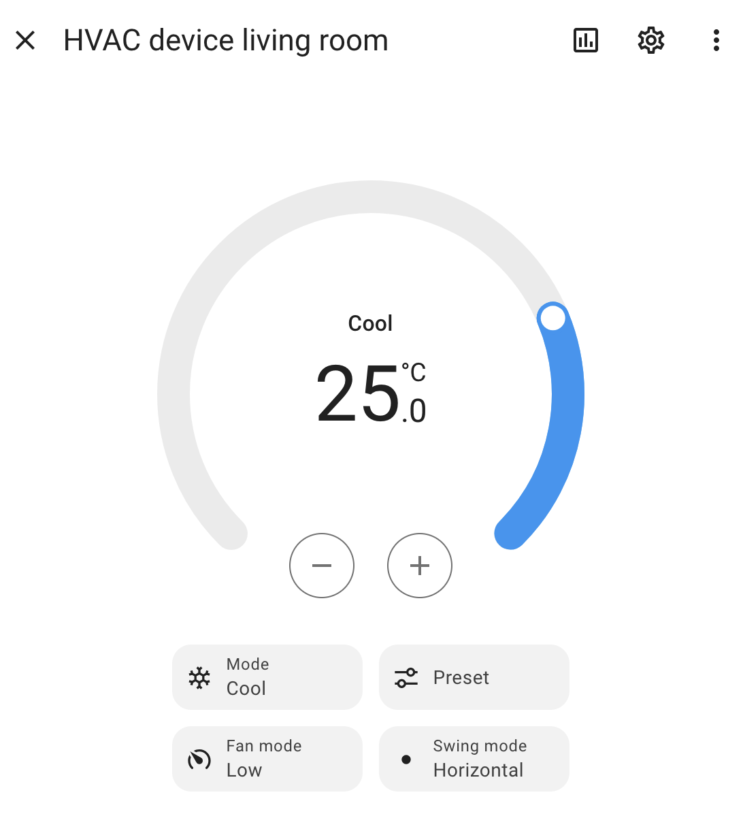

# ❄️🌡️ Sabiana HVAC Integration for Home Assistant (unofficial)

## Table of Contents

- [✨ Features](#-features)
- [📱 Screenshots](#-screenshots)
- [📋 Prerequisites](#-prerequisites)
- [🚀 Installation](#-installation)
- [⚙️ Configuration](#-configuration)
- [🚧 Limitations](#-limitations)
- [🌟 Upcoming Features](#-upcoming-features)
- [⚠️ Disclaimer & Legal Notice](#️-disclaimer--legal-notice)
- [🤝 Contributing](#contributing)
- [❓ Support](#support)
- [📄 License](#license)

Home Assistant custom integration designed to interface with Sabiana HVAC systems via their cloud API. This integration provides comprehensive control over your air conditioning units, seamlessly integrating them into your Home Assistant ecosystem.

## ✨ Features

*   **🌡️ Advanced Climate Control:** Gain granular control over Sabiana HVAC units, including setting HVAC modes (e.g., Cool, Heat, Fan Only, Off), target temperatures, fan speeds (Low, Medium, High, Auto), and swing modes.
*   **🔐 Secure API Authentication:** Utilizes secure, token-based authentication with the official Sabiana cloud API. User credentials (email and password) are securely stored exclusively on your local Home Assistant instance and are used solely for direct authentication with Sabiana servers.
*   **🖥️ Native Home Assistant UI Integration:** Devices are exposed as standard Home Assistant climate entities, enabling full control and monitoring through the native user interface, automations, and scripts.

## 📱 Screenshots

*Home Assistant climate card showing Sabiana HVAC integration in action*

## 📋 Prerequisites

*   **Home Assistant Instance:** A fully operational Home assistant installation.
*   **HACS:** [Home Assistant Community Store](https://hacs.xyz/) is highly recommended for simplified installation and updates of this custom integration.
*   **Sabiana Account:** A valid user account registered with the official Sabiana mobile application.
*   **Pre-Paired Devices:** Ensure your Sabiana HVAC devices are already paired and configured via the official Sabiana WiFi or Sabiana BLE mobile application. This integration leverages the existing cloud infrastructure for device communication.

## 🚀 Installation

### HACS (Home Assistant Community Store) - Automatic install - Recommended

### HACS (Home Assistant Community Store) - Manual install

1.  Navigate to HACS within your Home Assistant instance.
2.  Select "Integrations" from the sidebar.
3.  Click the three-dot menu in the top right corner and choose "Custom repositories."
4.  Enter the following repository URL: `https://github.com/edoeel/homeassistant-sabiana-hvac`
5.  Select "Integration" as the category.
6.  Click "Add."
7.  Locate "Sabiana HVAC" in the integrations list and proceed with its installation.
8.  A restart of your Home Assistant instance is required for the integration to become active.

## ⚙️ Configuration

1.  After restarting Home Assistant, go to "Settings" -> "Devices & Services."
2.  Click the "Add Integration" button.
3.  Search for "Sabiana HVAC" and select it.
4.  You will be prompted to enter your Sabiana account credentials (email and password). These are used to establish a secure connection with the Sabiana cloud API.
5.  Follow the on-screen wizard to complete the setup process, which includes device discovery.

## 🚧 Limitations

*   **Supported Devices**: Currently, this integration has been tested and confirmed to work exclusively with **Sabiana Carisma Fly** models. Support for other models may be added in future updates.
*   **Version Status**: This integration is currently in **Beta** phase. While functional, users may encounter bugs or unexpected behavior. Caution is advised for use in production environments, and bug reports are highly encouraged.

## 🌟 Upcoming Features

*   **Polling for Real-time State:** Implementation of a polling mechanism to retrieve and update the real-time operational state of each device. Currently, the device state is managed optimistically, meaning Home Assistant reflects the last commanded state rather than the actual device state.
*   **Automatic Token Refresh:** Introduction of an automatic process for refreshing the authentication token. The current token has a validity period of approximately 6 months, requiring manual re-authentication upon expiration.

## ⚠️ Disclaimer & Legal Notice
> **Important**: This integration is an unofficial independent project and is **not affiliated with, authorized, maintained, sponsored, or endorsed by Sabiana S.p.A.** or any of its affiliates or subsidiaries.

### 🔒 Privacy & Security

- **Credential Privacy**: Your Sabiana account credentials (email and password) are stored exclusively on your local Home Assistant instance
- **Data Usage**: Credentials are used solely to authenticate with the official Sabiana servers and are never transmitted to the developer of this integration or any third parties

### 🛠️ Development & Purpose

- **Independent Development**: This software was developed by the author without any contact, collaboration, or agreement with Sabiana S.p.A.
- **Non-Commercial Purpose**: This integration is provided free of charge as open-source software and is developed on a non-profit basis

### ⚖️ Legal & Liability

- **Disclaimer of Liability**: The use of this software is entirely at your own risk
- **No Warranty**: It is provided "as is" without warranty of any kind, express or implied
- **No Responsibility**: The developer assumes no responsibility or liability for any potential damage to your equipment, data loss, malfunctions, or other issues arising from the use of this integration

### 📝 Trademark Notice

All product names, logos, and registered trademarks are property of their respective owners. The use of the "Sabiana" name is for identification purposes only.

## 🤝 Contributing

Contributions are welcome! Please feel free to submit a Pull Request.

## ❓ Support

- [Report Issues](https://github.com/edoeel/homeassistant-sabiana-hvac/issues)
  When reporting issues, please provide as many logs as possible to facilitate troubleshooting.
- [Documentation](https://github.com/edoeel/homeassistant-sabiana-hvac)

## 📄 License

This project is licensed under the MIT License - see the [LICENSE](LICENSE) file for details.